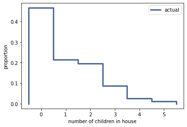
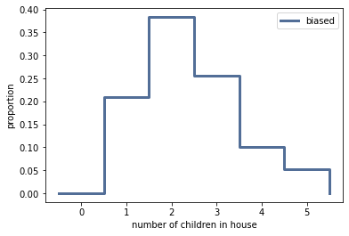

[Think Stats Chapter 3 Exercise 1](http://greenteapress.com/thinkstats2/html/thinkstats2004.html#toc31) (actual vs. biased)

**Code**  
```
# define actual distribution of children in household as pmf_actual
pmf_actual = thinkstats2.Pmf(resp.numkdhh, label='actual')

# plot actual distribution
thinkplot.pmf(pmf_actual)
thinkplot.Config(xlabel='number of children in house', ylabel='proportion')

#calculate mean of actual distribution
print('Actual mean children in household', pmf_actual.Mean())

# define biased distribution as pmf_biased 
pmf_biased = BiasPmf(pmf_actual, label='biased')

#plot biased distribution
thinkplot.pmf(pmf_biased)
thinkplot.Config(xlabel='number of children in house', ylabel='proportion')

#calculate mean of biased distribution
print('Biased/observed mean children in household', pmf_biased.Mean())
```

**Results**  
Actual mean children in household 1.024205155043831



Biased mean children in household 2.403679100664282



