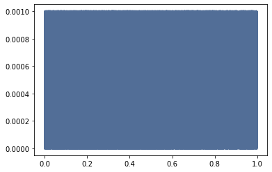
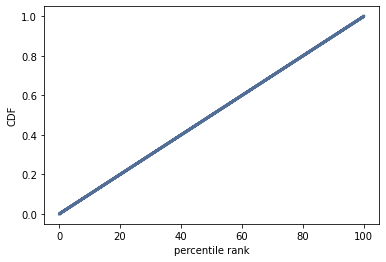

[Think Stats Chapter 4 Exercise 2](http://greenteapress.com/thinkstats2/html/thinkstats2005.html#toc41) (a random distribution)

**Code**  
```
# plot PMF of random array
pmf = thinkstats2.Pmf(random_sample, 'random numbers')
thinkplot.Pmf(pmf)

# plot CDF of random array
cdf = thinkstats2.Cdf(random_sample)
ranks = [cdf.PercentileRank(x) for x in random_sample]
rank_cdf = thinkstats2.Cdf(ranks)
thinkplot.Cdf(rank_cdf)
thinkplot.Show(xlabel='percentile rank', ylabel='CDF')
```

**Results**  




**Explanation**  
Based on the PDF's nearly perfectly straight top line of the grpah with a 0 slope, we can seems
that every number has a near, if not equal chance of being selected with numpy's
random number generator. The CDF's near perfectly straight line confirms this.
Overall, visually, the distirbution appears uniform with no bias towards specific
numbers between 0 and 1.